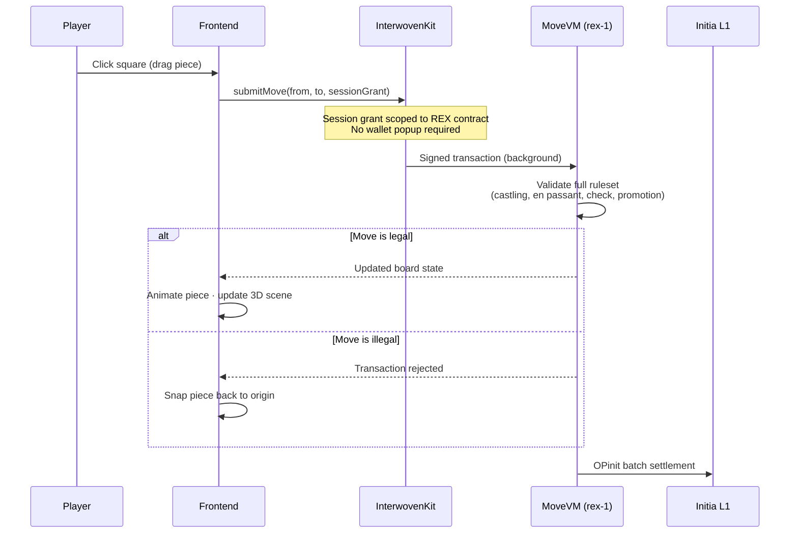
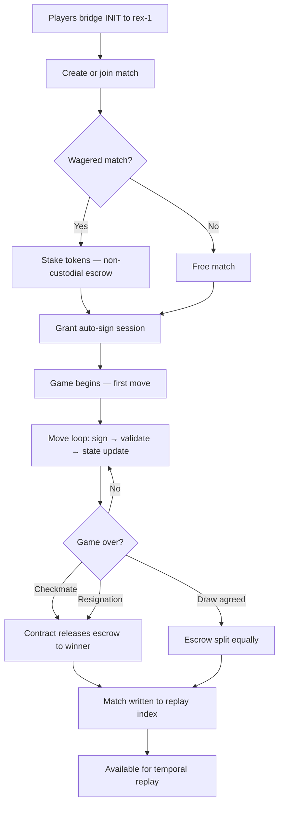
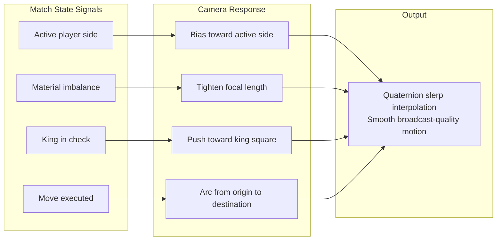
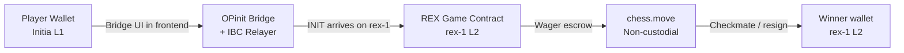
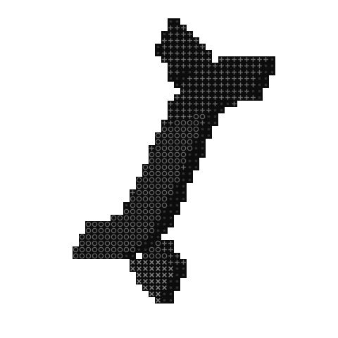

<div align="center">


<br />

# REX

### The world's first cinematic, fully on-chain chess arena — built as a sovereign Initia appchain.

<br />

[](https://initia.xyz)
[](https://move-language.github.io)
[](https://docs.pmnd.rs/react-three-fiber)
[]()
[]()
[]()
[]()
[](https://dorahacks.io/hackathon/initiate)

<br />

> **Chess has been played for 1,500 years. Every grandmaster move is documented. Every game is analyzed.**
> **Yet the game itself — its outcomes, its wagers, its history — has always lived on servers someone else owns.**
>
> **REX changes that.**

<br />

</div>

---

## 🏆 Hackathon Submission

| Field | Value |
|---|---|
| **Project Name** | REX |
| **Hackathon** | INITIATE Season 1 |
| **Chain ID** | `rex-1` |
| **VM** | MoveVM (Minitia L2) |
| **L1 Network** | Initia `initiation-2` |
| **Native Feature** | Auto-Signing via `@initia/interwovenkit-react` |
| **Contract Modules** | `chess.move` · `tournament.move` · `wager.move` |
| **Frontend** | React + React Three Fiber |
| **Explorer** | [scan.initia.xyz](https://scan.initia.xyz) |
| **Faucet** | [faucet.testnet.initia.xyz](https://faucet.testnet.initia.xyz) |

---

## 📦 What REX Is

Every move in REX is a **signed transaction**. Every match is an **immutable ledger record**. Board state is derived directly from chain state. The game logic is a formally verified Move smart contract running on `rex-1` — a sovereign appchain built for one purpose: chess.

This isn't a chess UI bolted onto a blockchain. **The blockchain is the game engine.**

```
Traditional chess app              REX
─────────────────────              ─────────────────────────────────────
Moves → server DB          →       Moves → signed transactions → chain
Results → centralized DB   →       Results → immutable ledger records
Wagers → third-party escrow →      Wagers → non-custodial smart contract
History → SQL query        →       History → on-chain state transitions
Rules → server-side code   →       Rules → formally verified Move module
```

---

## 🏗️ Architecture Overview

REX is built from three tightly integrated layers, each handling a distinct concern:

```
┌──────────────────────────────────────────────────────────────┐
│                      rex-frontend                            │
│              React + React Three Fiber + Vite                │
│                                                              │
│   ┌─────────────┐  ┌──────────────┐  ┌──────────────────┐   │
│   │  3D Board   │  │  Procedural  │  │  Cinematic Cam   │   │
│   │  Geometry   │  │    Pieces    │  │  Slerp Controller│   │
│   └─────────────┘  └──────────────┘  └──────────────────┘   │
│                                                              │
│         InterwovenKit — auto-signing · bridge · wallet       │
└─────────────────────────┬────────────────────────────────────┘
                          │  IBC / OPinit Bridge
┌─────────────────────────▼────────────────────────────────────┐
│                   rex-contract (MoveVM)                      │
│              Sovereign Minitia L2 — rex-1                    │
│                                                              │
│  ┌────────────┐  ┌───────────────┐  ┌─────────────────────┐  │
│  │ chess.move │  │tournament.move│  │    wager.move       │  │
│  │            │  │               │  │                     │  │
│  │ Full rules │  │  Bracket logic│  │  Escrow · Staking   │  │
│  │ Replay idx │  │  Prize settle │  │  Outcome resolution │  │
│  └────────────┘  └───────────────┘  └─────────────────────┘  │
└─────────────────────────┬────────────────────────────────────┘
                          │  OPinit Optimistic Rollup
┌─────────────────────────▼────────────────────────────────────┐
│                Initia L1 — initiation-2                      │
│       Security · Finality · Fraud Proofs · Shared Liquidity  │
└──────────────────────────────────────────────────────────────┘
```

---

## ⚙️ How It Works

### Move Transaction Lifecycle



### On-Chain Game Lifecycle



---

## 🔩 Core Components

### Move VM — The Rulebook as Code

The entire chess ruleset is encoded as a Move smart contract. Every legal move — including edge cases — is enforced on-chain before acceptance.

| Rule | Implementation |
|---|---|
| Castling | King/rook move history tracked as resource flags; attacked-square validation via bitboard |
| En passant | Pawn double-push logged per-turn; capture window expires after one half-move |
| Promotion | All four variants (Q, R, B, N) supported; piece minted as new resource on promotion |
| Check detection | King position crossed against all opponent attack vectors before any move commits |
| Stalemate | Legal move count computed; zero legal moves with king not in check = draw |
| Threefold repetition | Board hash logged per move; match on third occurrence triggers draw claim |

The Move language's **resource model** makes this uniquely natural: a `Piece` is a typed resource, not an integer in a mapping. It can be moved, captured, and promoted with the same formal safety guarantees that govern token transfers. The board state cannot be corrupted by a bad actor or an offline server.

---

### React Three Fiber — The Arena

Every chess piece is procedurally generated in the browser at runtime. There are no `.glb` or `.obj` asset files to download.

```
Piece Construction Pipeline
──────────────────────────────────────────────────────────
1. 2D profile curve defined per Staunton piece type
   (king, queen, rook, bishop, knight, pawn)

2. LatheGeometry rotates curve 360° around Y-axis
   → produces base body and stem

3. ExtrudeGeometry adds piece-specific detail
   (cross finial, bishop mitre cut, knight head)

4. PBR materials applied:
   - roughnessMap      → physical surface texture
   - aoMap             → ambient occlusion depth
   - envMapIntensity   → environment reflections

5. Instanced rendering for board squares
   (64 squares drawn in a single draw call)
──────────────────────────────────────────────────────────
```

**Why procedural?**
- No asset download = instant load
- Dynamic LOD based on device capability
- Clean renders at any zoom / resolution
- Piece variants (material, color) via shader uniform, not new meshes

---

### Kinetic Camera — Spherical Interpolation

The camera is never static. It uses **quaternion slerp** to arc between orbital positions driven by live match state:



The result is a broadcast-quality viewing experience. The blockchain is abstracted entirely — the player sees cinema, not infrastructure.

---

### Auto-Signing — Frictionless Gameplay

The defining UX problem of on-chain games is the **wallet interruption**. Requiring a signature prompt for every move breaks flow, breaks immersion, breaks the game.

REX solves this at the protocol level using Initia's native auto-signing via `InterwovenKit`:

```
Without auto-signing                 With REX auto-signing
─────────────────────                ─────────────────────────────────
Move 1 → wallet popup     →          Match start → one session grant
Move 2 → wallet popup     →          Move 1 → background tx (0 popups)
Move 3 → wallet popup     →          Move 2 → background tx (0 popups)
...                                  ...
Move N → wallet popup     →          Move N → background tx (0 popups)

~2s interruption per move            Sub-second, indistinguishable from
Total: minutes of friction           a traditional web game
```

**Session grant properties:**
- Scoped strictly to the REX contract address
- Time-limited (configurable per match)
- Revocable from the wallet at any moment
- Zero additional permissions granted

---

### Interwoven Bridge — Seamless Funding

REX lives on `rex-1`, its own Minitia L2. Bridging INIT from the L1 happens **inside the frontend** — no external bridge site, no multi-tab flow.



---

## ✨ Feature Set

| Feature | Description |
|---|---|
| ♟ **Complete On-Chain Ruleset** | Castling, en passant, all four promotion variants — enforced by Move contract. No client-side authority over validity. |
| 🎬 **Temporal Replay Engine** | Full 3D board reconstruction at any point in match history. Scrub forward, pause, step through any line — derived from ledger, not a database. |
| 🏆 **Sovereign Tournament Module** | Bracket construction, entry fees, round progression, and prize distribution entirely on-chain. No administrator, no alterable results. |
| ⚡ **Wagered Protocol** | Players stake native tokens before the first move. Contract holds in non-custodial escrow, releases automatically on checkmate or resignation. |
| 🔁 **Enshrined Auto-Signing** | One session approval. Unlimited moves. Scoped, time-limited, revocable. Zero popups mid-game. |
| 🌉 **Interwoven Bridge** | Bridge INIT directly within the frontend. OPinit executor and IBC relayer handle cross-chain settlement silently. |
| 📐 **Procedural 3D Pieces** | All Staunton silhouettes assembled from 2D curves at runtime. No `.glb` files, no load times, infinite zoom. |
| 🎥 **Cinematic Camera** | Quaternion slerp orbital camera driven by match state — material balance, check, active player, move execution. |

---

## 📁 Repository Structure

```
rex/
├── rex-contract/
│   ├── sources/
│   │   ├── chess.move          # Board state, move validation, game lifecycle, replay index
│   │   ├── tournament.move     # Bracket logic, entry fees, round progression, prize settlement
│   │   └── wager.move          # Escrow management, match staking, outcome resolution
│   └── Move.toml               # Package manifest, dependencies
│
├── rex-frontend/
│   ├── src/
│   │   ├── components/
│   │   │   ├── Board.jsx           # 3D board geometry, PBR materials, instanced squares
│   │   │   ├── Piece.jsx           # Procedural lathe/extrude renderer, per-type profiles
│   │   │   ├── Camera.jsx          # Quaternion slerp orbital controller, state-driven
│   │   │   └── ReplayEngine.jsx    # Match timeline scrubber, on-chain state reconstruction
│   │   ├── hooks/
│   │   │   ├── useAutoSign.js      # InterwovenKit session wrapper, grant lifecycle
│   │   │   └── useChainState.js    # On-chain board state sync, optimistic updates
│   │   └── App.jsx
│   └── package.json
│
└── .initia/
    └── submission.json
```

---

## 🛠️ Tech Stack

| Layer | Technology | Role |
|---|---|---|
| Smart Contract | Move (MoveVM) | Chess ruleset, tournaments, escrow, replay index |
| L2 Rollup | Initia OPinit Stack | Sovereign appchain `rex-1`, fraud proofs |
| L1 Security | Initia `initiation-2` | Finality, shared liquidity, settlement |
| Frontend Shell | React + Vite | App routing, state management |
| 3D Renderer | React Three Fiber | Board, pieces, lighting, PBR materials |
| Wallet & Sessions | InterwovenKit | Auto-signing, bridge, wallet connection |
| Cross-chain | IBC + OPinit | L1 ↔ L2 asset movement, relaying |
| JS SDK | initia.js | Transaction construction and broadcast |
| 3D Geometry | `LatheGeometry` / `ExtrudeGeometry` | Procedural Staunton pieces, no asset files |

---

## 🚀 Quick Start

**Prerequisites:** Docker Desktop · Go 1.22+ · Node.js 18+ · `weave` CLI

### Step-by-step

```bash
# 1 — Initialize the appchain
#     Prompts: select Move VM · set Chain ID to rex-1 · add Gas Station to genesis
weave init

# 2 — Start cross-chain infrastructure (detached)
weave opinit start executor -d
weave relayer start -d

# 3 — Import Gas Station key into both L1 and L2 keychains
MNEMONIC=$(jq -r '.common.gas_station.mnemonic' ~/.weave/config.json)

initiad keys add gas-station --recover --keyring-backend test \
  --coin-type 60 --key-type eth_secp256k1 --source <(echo -n "$MNEMONIC")

minitiad keys add gas-station --recover --keyring-backend test \
  --coin-type 60 --key-type eth_secp256k1 --source <(echo -n "$MNEMONIC")

# 4 — Deploy the Move contract modules
cd rex-contract
minitiad move deploy --keyring-backend test --from gas-station

# 5 — Launch the frontend
cd ../rex-frontend && npm install && npm run dev
```

> Open `http://localhost:3000` — the board is live.

Need testnet INIT? → [faucet.testnet.initia.xyz](https://faucet.testnet.initia.xyz)

---

## 🌐 Local Endpoints

| Service | URL | Purpose |
|---|---|---|
| Rollup RPC | `http://localhost:26657` | Transaction broadcast, block queries |
| Rollup REST | `http://localhost:1317` | REST API, contract state queries |
| Rollup Indexer | `http://localhost:8080` | Move event indexing, replay data |
| L1 Testnet RPC | `https://rpc.testnet.initia.xyz` | L1 connection, IBC channels |
| L1 Testnet REST | `https://rest.testnet.initia.xyz` | L1 REST queries |
| Block Explorer | [scan.initia.xyz](https://scan.initia.xyz) | Transaction inspection, contract state |

---

## 📋 Contract Module Reference

### `chess.move`

| Function | Description |
|---|---|
| `create_game(white, black)` | Initializes board resource with standard starting position |
| `submit_move(game_id, from, to, promotion?)` | Validates and applies a move; emits `MoveEvent` |
| `resign(game_id)` | Terminates game, emits outcome event |
| `claim_draw(game_id)` | Validates draw condition (stalemate, repetition, 50-move) |
| `snapshot(game_id, move_num)` | Writes board hash to replay index for scrubbing |

### `tournament.move`

| Function | Description |
|---|---|
| `create_tournament(entry_fee, max_players, format)` | Initializes bracket resource |
| `enter_tournament(tournament_id)` | Collects entry fee, adds player to bracket |
| `advance_round(tournament_id)` | Progresses bracket on round completion |
| `distribute_prizes(tournament_id)` | Releases prize pool to bracket winners |

### `wager.move`

| Function | Description |
|---|---|
| `create_wager(game_id, amount)` | Stakes tokens in non-custodial escrow |
| `match_wager(game_id)` | Second player matches stake to activate escrow |
| `resolve(game_id, outcome)` | Called by chess module on game end; releases funds |
| `cancel_wager(game_id)` | Returns stake if match never started |

---

## 🏁 Initia Hackathon Submission Detail

### What Was Built

**The Custom Implementation:** A complete Move smart contract encoding chess as type-safe, deterministic resource state transitions — including:
- Full 8×8 board as a typed Move resource (not a key-value map)
- Temporal replay index: board snapshots keyed by move number, stored on-chain
- Tournament module with automated bracket construction and cryptographic prize settlement
- Wager module using the contract as non-custodial escrow with outcome-triggered release

**The Native Feature:** REX implements **auto-signing** via `@initia/interwovenkit-react`. Players grant a single scoped session before a match. Every subsequent move is submitted as a background transaction with zero wallet interruption — converting an on-chain game into a sub-second, frictionless experience indistinguishable from traditional web gaming.

---

<div align="center">

<br />



<br />

*Built on the Interwoven Stack — INITIATE Season 1*

</div>